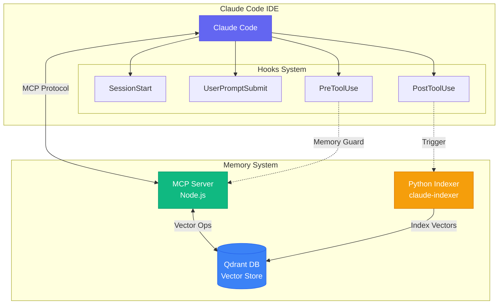
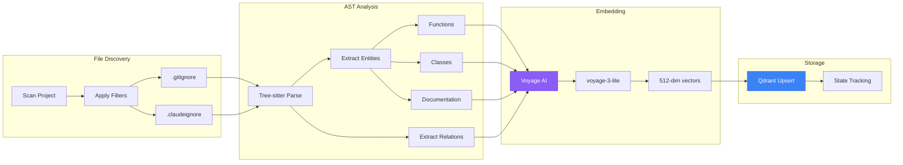
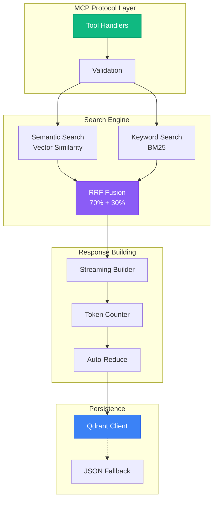
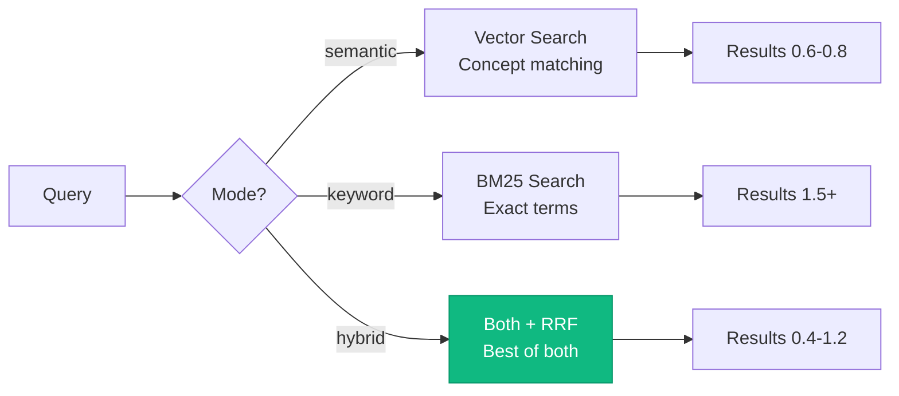
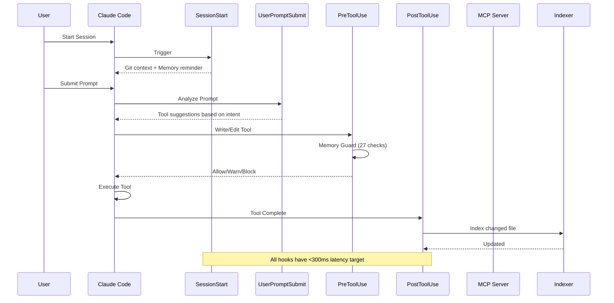
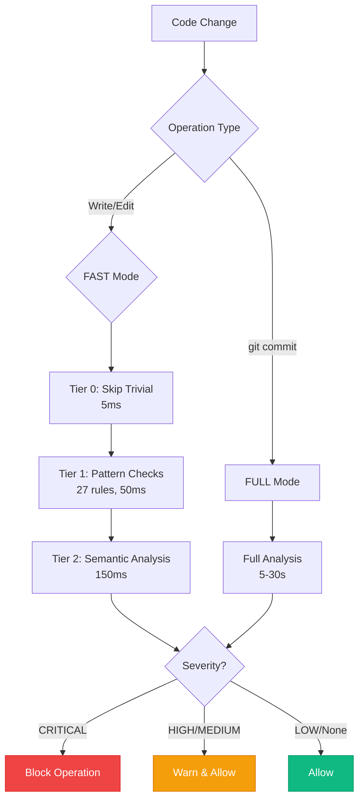
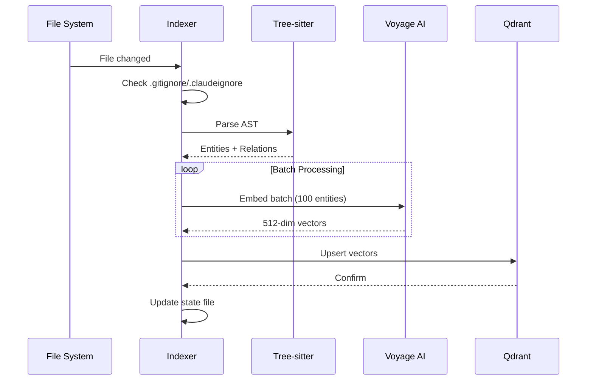
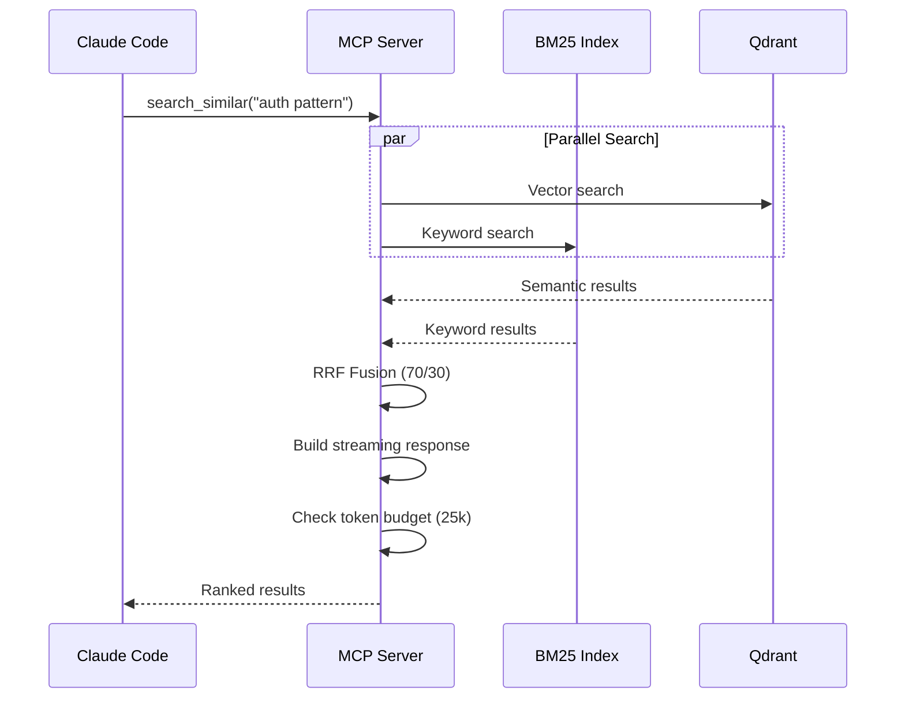
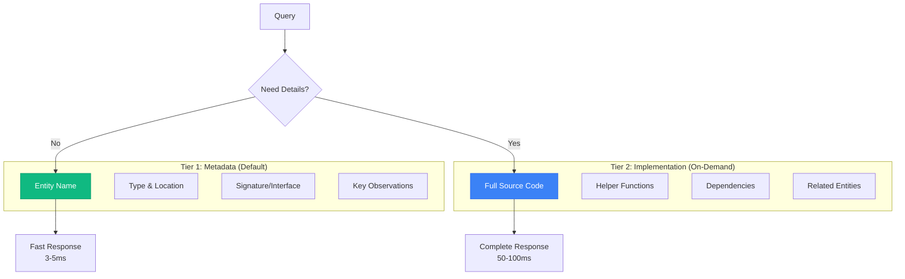
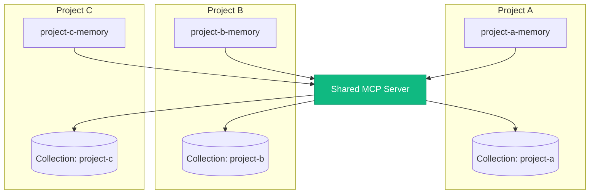

# Claude Code Memory - System Architecture

> **Semantic code memory for Claude Code** - Instant recall across your entire codebase

This document provides a comprehensive overview of the Claude Code Memory system architecture, including component interactions, data flows, and key design decisions.

---

## High-Level Overview



### Component Summary

| Component | Technology | Purpose |
|-----------|------------|---------|
| **Claude Code** | VS Code Extension | AI-powered coding assistant |
| **MCP Server** | Node.js/TypeScript | Memory retrieval and graph operations |
| **Python Indexer** | Python 3.12 | AST parsing, embedding generation, indexing |
| **Qdrant** | Vector Database | Semantic storage with hybrid search |
| **Hooks** | Bash/Python | Automation triggers for memory operations |

---

## Component Architecture

### 1. Python Indexer (`claude_indexer/`)

The indexer is responsible for parsing source code and generating semantic embeddings.



#### Key Modules

| Module | File | Responsibility |
|--------|------|----------------|
| **CLI** | `cli_full.py` | Command-line interface with Click |
| **Indexer** | `indexer.py` | Core indexing logic and batch processing |
| **Parser** | `analysis/parser.py` | Tree-sitter AST parsing |
| **Language Parsers** | `analysis/*.py` | Python, JS, TS, JSON, YAML, etc. |
| **Embeddings** | `embeddings/voyage.py` | Voyage AI embedding generation |
| **Storage** | `storage/qdrant.py` | Qdrant vector operations |

#### Supported Languages

| Language | Parser | Features |
|----------|--------|----------|
| Python | Tree-sitter + Jedi | Functions, classes, decorators, docstrings |
| JavaScript/TypeScript | Tree-sitter | Functions, classes, exports, JSDoc |
| JSON | Native | Schema extraction, key-value pairs |
| YAML | Native | Configuration parsing |
| HTML | Tree-sitter | Tags, attributes, structure |
| CSS | Tree-sitter | Selectors, rules, variables |
| Markdown | Native | Headers, code blocks, links |

---

### 2. MCP Server (`mcp-qdrant-memory/`)

The MCP (Model Context Protocol) server provides memory retrieval capabilities to Claude Code.



#### Available Tools

| Tool | Purpose | Key Parameters |
|------|---------|----------------|
| `search_similar` | Semantic + keyword search | `query`, `limit`, `entityTypes`, `searchMode` |
| `read_graph` | Entity relationship exploration | `entity`, `mode` (smart/entities/relationships/raw) |
| `get_implementation` | Retrieve code with context | `name`, `scope` (exact/logical/dependencies) |
| `create_entities` | Add new knowledge | `entities[]` with name, type, observations |
| `add_observations` | Update existing entities | `observations[]` with entityName, contents |
| `delete_entities` | Remove entities | `entityNames[]` |
| `create_relations` | Link entities | `relations[]` with from, to, type |
| `delete_relations` | Remove links | `relations[]` |

#### Search Modes



---

### 3. Claude Code Hooks

Hooks automate memory operations at key points in the development workflow.



#### Hook Details

| Hook | File | Trigger | Performance |
|------|------|---------|-------------|
| **SessionStart** | `session_start.py` | Session begins | <100ms |
| **UserPromptSubmit** | `prompt_handler.py` | Before Claude processes | <50ms |
| **PreToolUse** | `pre-tool-guard.sh` | Before Write/Edit/Bash | <300ms |
| **PostToolUse** | `post-file-change.sh` | After Write/Edit | ~100ms/file |

---

### 4. Memory Guard System

Memory Guard enforces code quality through pattern-based checks.



#### Check Categories (27 Total)

| Category | Count | Examples |
|----------|-------|----------|
| **Security** | 11 | SQL injection, XSS, secrets, crypto |
| **Tech Debt** | 9 | TODO, FIXME, debug statements, bare except |
| **Documentation** | 2 | Missing docstrings, JSDoc |
| **Resilience** | 2 | Swallowed exceptions, HTTP timeouts |
| **Git Safety** | 3 | Force push, hard reset, destructive rm |

---

## Data Flow

### Indexing Pipeline



### Query Pipeline



---

## Search Architecture

### Hybrid Search with RRF Fusion

```mermaid
flowchart LR
    subgraph "Input"
        Q[Query: 'validate user token']
    end

    subgraph "Semantic Path"
        SE[Embed Query]
        SV[Vector Search]
        SR[Conceptual Matches<br/>validate, auth, verify]
    end

    subgraph "Keyword Path"
        KT[Tokenize]
        KB[BM25 Rank]
        KR[Exact Matches<br/>'validate', 'user', 'token']
    end

    subgraph "Fusion"
        RRF[RRF Algorithm<br/>1/(k+rank)]
        W[Weighted Combine<br/>70% semantic<br/>30% keyword]
    end

    subgraph "Output"
        R[Ranked Results]
    end

    Q --> SE --> SV --> SR --> RRF
    Q --> KT --> KB --> KR --> RRF
    RRF --> W --> R

    style RRF fill:#8b5cf6,stroke:#7c3aed,color:#fff
```

### Entity Types

| Type | Description | Use Case |
|------|-------------|----------|
| `function` | Functions and methods | Implementation lookup |
| `class` | Classes and components | Architecture exploration |
| `file` | File-level metadata | Quick overview |
| `documentation` | Code documentation | Understanding context |
| `relation` | Entity connections | Dependency analysis |
| `metadata` | Fast entity overview | Quick search |
| `implementation` | Detailed code chunks | Deep dive |
| `*_pattern` | Learned patterns | Best practices |

---

## Progressive Disclosure Architecture

The system uses a two-tier approach for optimal performance:



---

## Multi-Project Support

Each project maintains isolated memory with unique collection names:



### Collection Naming

- Format: `{project-name}-sanitized`
- Characters: lowercase, hyphens only
- Example: `my-awesome-project` → `my-awesome-project`

---

## Performance Characteristics

### Latency Targets

| Operation | Target | Actual |
|-----------|--------|--------|
| Metadata search | <10ms | 3-5ms |
| Full entity search | <100ms | 50-80ms |
| Single file index | <500ms | 100-300ms |
| Batch index (100 files) | <30s | 10-20s |
| Memory Guard (FAST) | <300ms | 150-250ms |

### Scaling

| Metric | Capacity |
|--------|----------|
| Vectors per collection | 100,000+ |
| Files per project | 10,000+ |
| Concurrent searches | 100+ |
| Embedding batch size | 100 entities |

---

## Configuration Files

| File | Location | Purpose |
|------|----------|---------|
| `.mcp.json` | Project root | MCP server configuration |
| `settings.local.json` | `.claude/` | Hook configuration |
| `.claudeignore` | Project root | Indexing exclusions |
| `settings.txt` | Memory project | API keys and settings |

---

## Technology Stack

### Core Technologies

| Layer | Technology | Version |
|-------|------------|---------|
| **Runtime** | Python | 3.12+ |
| **Runtime** | Node.js | 18+ |
| **Vector DB** | Qdrant | 1.7+ |
| **Embeddings** | Voyage AI | voyage-3-lite |
| **AST Parsing** | Tree-sitter | Latest |

### Key Dependencies

| Package | Purpose |
|---------|---------|
| `qdrant-client` | Vector database client |
| `voyageai` | Embedding generation |
| `tree-sitter` | AST parsing |
| `click` | CLI framework |
| `@modelcontextprotocol/sdk` | MCP server framework |

---

## Further Reading

- [CLI Reference](docs/CLI_REFERENCE.md) - Complete command documentation
- [Memory Guard](docs/MEMORY_GUARD.md) - Quality check details
- [Hooks System](docs/HOOKS.md) - Hook configuration guide
- [MCP Server](mcp-qdrant-memory/README.md) - Server implementation details
