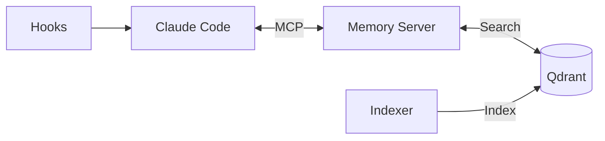
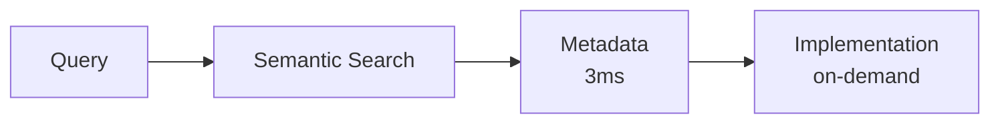
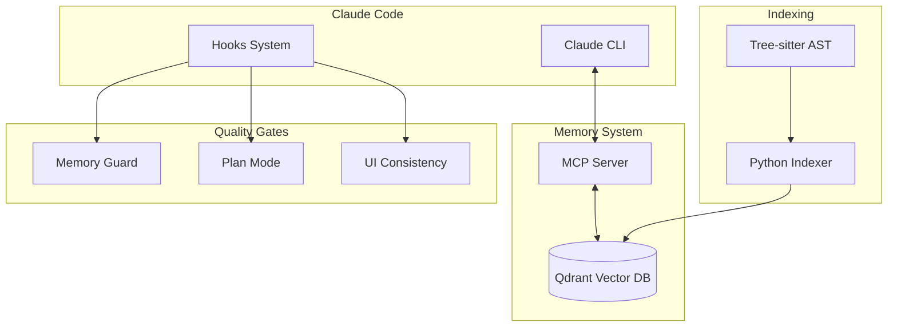

# Claude Code Memory

> Transform Claude Code into a senior architect with perfect memory of your codebase



---

## The Problem

Every Claude Code session starts from scratch:

- "What's your project structure?" - Asked every. single. time.
- Creates functions that already exist
- Misses established patterns in your codebase
- No memory of past debugging solutions
- Wastes 10-15 minutes per session on context

## The Solution

**One command gives Claude permanent memory:**

```bash
./setup.sh -p /path/to/your/project -c my-project
```

Now Claude:
- Instantly recalls your entire codebase
- Finds and reuses existing patterns
- Remembers past bug fixes
- Follows your architectural conventions
- Starts coding immediately with full context

---

## What You Get

### 1. Semantic Code Memory



- **3.99ms** search across millions of lines of code
- **Hybrid search**: semantic understanding + keyword matching
- **Progressive disclosure**: fast metadata, detailed code when needed
- **Multi-language**: Python, JavaScript, TypeScript, Go, Rust, and more

### 2. Memory Guard v4.3

27 pattern-based quality checks in <300ms:

| Category | Checks | Examples |
|----------|--------|----------|
| Security | 11 | SQL injection, XSS, secrets, crypto |
| Tech Debt | 9 | TODO/FIXME, debug statements, bare except |
| Documentation | 2 | Missing docstrings, JSDoc |
| Resilience | 2 | Swallowed exceptions, HTTP timeouts |
| Git Safety | 3 | Force push, hard reset, destructive rm |

**Two modes:**
- **FAST** (<300ms): Pattern checks on every Write/Edit
- **FULL** (5-30s): Comprehensive AI analysis before commits

### 3. Plan Mode Integration

5 quality rules validate every implementation plan:

| Rule | Detects | Auto-Fix |
|------|---------|----------|
| Test Requirement | Features without tests | Adds test task |
| Doc Requirement | User-facing changes without docs | Adds doc task |
| Duplicate Detection | Code that already exists | References existing |
| Architectural Consistency | Non-standard file paths | Adds warning |
| Performance Pattern | N+1 queries, missing cache | Adds note |

**Automatic activation** via `@plan` marker or planning keywords.

See [Plan Mode Guide](docs/PLAN_MODE.md) for details.

### 4. UI Consistency Guard

15+ rules enforce design tokens across React, Vue, and Svelte:

| Category | Rules | Examples |
|----------|-------|----------|
| Token Drift | 4 | Hardcoded colors, spacing, radius |
| Duplication | 4 | Duplicate styles, component clusters |
| CSS Smells | 3 | Specificity escalation, !important |
| Inconsistency | 4 | Button/input outliers |

**Three tiers:**
- **Tier 0** (<300ms): Pre-commit token drift check
- **Tier 1** (<10min): CI audit with SARIF output
- **Tier 2** (<5min): On-demand design critique

See [UI Consistency Guide](docs/UI_CONSISTENCY_GUIDE.md) for details.

---

## Quick Start

### Prerequisites

- Python 3.9+ (3.12 recommended)
- Node.js 18+
- Docker (for Qdrant)
- Claude Code CLI
- API Key: Voyage AI (recommended) or OpenAI

### Setup (30 seconds)

```bash
# Clone
git clone https://github.com/rlefko/claude-code-critic.git
cd claude-code-critic

# Run automated setup
./setup.sh -p /path/to/your/project -c my-project
```

The setup script handles everything:
- Installs Python and Node.js dependencies
- Prompts for API keys (saved securely)
- Starts Qdrant via Docker (if needed)
- Builds and configures MCP server
- Installs git hooks for auto-indexing
- Runs initial codebase indexing
- Generates project-specific CLAUDE.md

**That's it.** Claude now has memory of your codebase.

### Manual Setup

<details>
<summary>Click to expand manual installation steps</summary>

```bash
# 1. Clone and create virtual environment
git clone https://github.com/rlefko/claude-code-critic.git
cd claude-code-critic
python3.12 -m venv .venv
source .venv/bin/activate
pip install -r requirements.txt

# 2. Configure API keys
cp settings.template.txt settings.txt
# Edit settings.txt with your keys:
# - VOYAGE_API_KEY or OPENAI_API_KEY (embeddings)
# - OPENAI_API_KEY (for chat analysis)

# 3. Install MCP server
cd mcp-qdrant-memory
npm install && npm run build
cp .env.example .env
# Edit .env with same API keys
cd ..

# 4. Start Qdrant
docker run -p 6333:6333 -v $(pwd)/qdrant_storage:/qdrant/storage qdrant/qdrant

# 5. Install global command
./install.sh

# 6. Index your project
claude-indexer index -p /your/project -c my-project

# 7. Configure Claude
claude-indexer add-mcp -c my-project
```

</details>

---

## CLI Reference

### Indexing

```bash
# Index project
claude-indexer index -p /path/to/project -c collection-name

# Index with verbose output
claude-indexer index -p . -c my-project --verbose

# Clear and reindex (preserves manual entries)
claude-indexer index -p . -c my-project --clear

# Real-time file watching
claude-indexer watch start -p . -c my-project
```

### Search

```bash
# Semantic search
claude-indexer search "authentication" -p . -c my-project

# Keyword search (BM25)
claude-indexer search "login function" -c my-project --mode keyword

# Hybrid search (semantic + keyword)
claude-indexer search "auth pattern" -c my-project --mode hybrid
```

### Memory Guard

```bash
# Pre-commit check
claude-indexer ui-guard src/components/Button.tsx

# CI audit with SARIF
claude-indexer quality-gates run ui --format sarif -o results.sarif

# Design critique
claude-indexer redesign --focus "button components"
```

### Service Management

```bash
# Multi-project background service
claude-indexer service start
claude-indexer service add-project /path/to/project project-name
claude-indexer service status
```

See [CLI Reference](docs/CLI_REFERENCE.md) for complete documentation.

---

## MCP Memory Functions

Once configured, Claude has access to these memory functions:

```python
# Semantic search
mcp__project-memory__search_similar("query", entityTypes=["function", "class"])

# Graph exploration
mcp__project-memory__read_graph(entity="AuthService", mode="smart")

# Get implementation
mcp__project-memory__get_implementation("functionName", scope="logical")

# Search design docs
mcp__project-memory__search_docs("authentication spec", docTypes=["prd", "tdd"])
```

See [Memory Functions](docs/memory-functions.md) for details.

---

## Performance

| Operation | Latency |
|-----------|---------|
| Semantic search | 3-5ms |
| Hybrid search | 30-50ms |
| Single file index | 100-300ms |
| Batch index (100 files) | 10-20s |
| Memory Guard (FAST) | 150-250ms |
| Plan validation | <500ms |

### Scaling

| Metric | Capacity |
|--------|----------|
| Vectors per collection | 100,000+ |
| Files per project | 10,000+ |
| Concurrent searches | 100+ |

---

## Architecture



See [Architecture](ARCHITECTURE.md) for detailed system design.

---

## Documentation

| Document | Description |
|----------|-------------|
| [Plan Mode Guide](docs/PLAN_MODE.md) | Quality guardrails for planning |
| [Memory Guard](docs/MEMORY_GUARD.md) | 27 code quality checks |
| [UI Consistency](docs/UI_CONSISTENCY_GUIDE.md) | Design system enforcement |
| [CLI Reference](docs/CLI_REFERENCE.md) | Complete command reference |
| [Hooks System](docs/HOOKS.md) | Hook configuration |
| [Memory Functions](docs/memory-functions.md) | MCP tool reference |
| [Troubleshooting](docs/TROUBLESHOOTING.md) | Common issues |
| [Architecture](ARCHITECTURE.md) | System design |

---

## Troubleshooting

### "claude-indexer: command not found"

```bash
./install.sh
# Or add to PATH:
export PATH="$PATH:$HOME/claude-code-critic"
```

### API Key Errors

- Check `settings.txt` has correct keys
- Ensure MCP `.env` matches `settings.txt`
- Use same embedding provider for indexing and searching

### Qdrant Connection Failed

```bash
# Check if running
curl http://localhost:6333/health

# Restart
docker run -p 6333:6333 -v $(pwd)/qdrant_storage:/qdrant/storage qdrant/qdrant
```

### Memory Guard Not Working

- Verify hooks in `~/.claude/settings.json`
- Check `memory_guard_debug.txt` in project root
- Ensure MCP collection is configured

See [Troubleshooting Guide](docs/TROUBLESHOOTING.md) for more.

---

## Contributing

- [Report bugs](https://github.com/rlefko/claude-code-critic/issues)
- [Request features](https://github.com/rlefko/claude-code-critic/issues)
- [Start a discussion](https://github.com/rlefko/claude-code-critic/discussions)

---

## Web Explorer

Visualize your indexed codebases with the companion web UI:

[Code Memory Explorer](https://github.com/rlefko/code-memory-explorer)

- Interactive graph visualization
- Semantic search across collections
- Code viewer with syntax highlighting
- Real-time WebSocket updates

---

**One command. 30 seconds. Claude becomes omniscient.**
