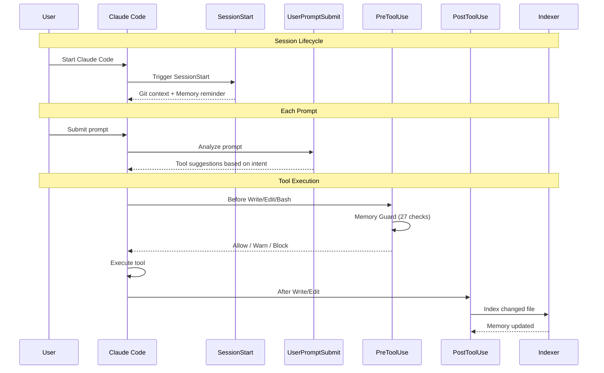
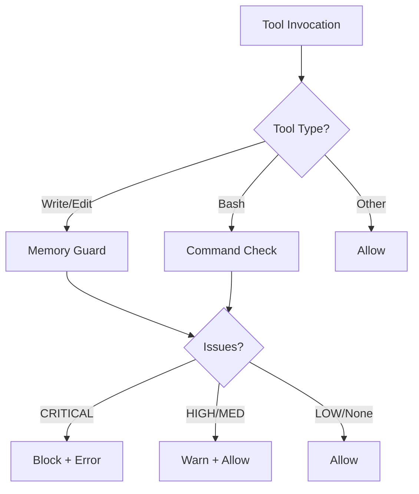

# Claude Code Hooks System

> **Automated memory operations** at key points in your development workflow

The hooks system integrates Claude Code Memory into your development workflow, automatically handling context injection, code quality checks, and memory updates.

---

## Architecture



---

## Available Hooks

### SessionStart (`session_start.py`)

**Trigger**: When a Claude Code session begins

**Purpose**:
- Display current git branch and status
- Show recent commit history
- Remind about memory-first workflow
- Inject MCP tool suggestions

**Performance**: < 100ms

**Output Example**:
```
=== Session Context ===
Branch: feature/new-auth
Uncommitted changes: 3 file(s)
Recent commits:
  - Add user validation
  - Fix login redirect
  - Update auth middleware

Memory-First Reminder:
  Use `mcp__project-memory__search_similar()` before reading files
  Use `mcp__project-memory__read_graph()` to understand relationships
```

---

### UserPromptSubmit (`prompt_handler.py`)

**Trigger**: Before Claude processes each user prompt

**Purpose**:
- Detect prompt intent (search, debug, implement, refactor, understand)
- Inject appropriate MCP tool suggestions
- Warn about sensitive content in prompts

**Performance**: < 50ms

**Intent Detection**:

| Intent | Trigger Words | Suggested Tool |
|--------|---------------|----------------|
| Search | find, search, locate, where | `search_similar()` |
| Debug | error, bug, fix, issue | `search_similar(..., entityTypes=["debugging_pattern"])` |
| Implement | add, create, build, write | `search_similar()` to find patterns |
| Refactor | refactor, improve, optimize | `read_graph(mode="smart")` |
| Understand | how does, explain, architecture | `read_graph()` |

**Output Example**:
```
User: "fix the authentication error"

Injected context:
Check `mcp__project-memory__search_similar("error description", entityTypes=["debugging_pattern"])` for past solutions
```

---

### Plan Mode Context Injection (Milestone 7.2)

**Trigger**: When Plan Mode is detected via `UserPromptSubmit`

**Purpose**:
- Inject planning guidelines to improve plan quality
- Generate exploration hints for code discovery
- Ensure plans include testing and documentation tasks
- Guide Claude to check for existing code before implementing

**Performance**: < 50ms total

**Components**:

| Component | Purpose | Target Latency |
|-----------|---------|----------------|
| Guidelines Generator | Planning quality templates | < 20ms |
| Exploration Hints | Entity extraction + MCP hints | < 30ms |
| Context Injector | Coordinates injection | < 50ms total |

**Planning Guidelines Include**:
1. **Code Reuse Check** - Search memory before implementing new code
2. **Testing Requirements** - Include test tasks for new features
3. **Documentation Requirements** - Include doc tasks for user-facing changes
4. **Architecture Alignment** - Follow project patterns from CLAUDE.md
5. **Performance Considerations** - Flag potential anti-patterns

**Exploration Hints Include**:
- Duplicate detection queries (search for similar existing code)
- Test file discovery (find related test files)
- Documentation discovery (locate relevant docs)
- Entity relationship analysis (understand dependencies)

**Entity Extraction**:
The hints generator extracts entities from prompts using:
- CamelCase patterns (e.g., `UserService`, `AuthController`)
- snake_case patterns (e.g., `user_service`, `auth_handler`)
- Quoted terms (e.g., `"login"`, `'authentication'`)
- Technical terms (e.g., `api`, `database`, `middleware`)

**Configuration**:

Environment variables:
- `CLAUDE_PLAN_MODE_COMPACT=true` - Use abbreviated guidelines
- `CLAUDE_PLAN_MODE_CONFIG=/path/to/config.json` - Custom config file

Config file format:
```json
{
  "enabled": true,
  "inject_guidelines": true,
  "inject_hints": true,
  "compact_mode": false,
  "guidelines": {
    "include_code_reuse_check": true,
    "include_testing_requirements": true,
    "include_documentation_requirements": true,
    "include_architecture_alignment": true,
    "include_performance_considerations": true
  },
  "hints": {
    "max_entity_hints": 3,
    "include_duplicate_check": true,
    "include_test_discovery": true,
    "include_doc_discovery": true,
    "include_architecture_hints": true
  }
}
```

**Output Example**:
```
[Plan Mode Active: explicit_marker, confidence=100%]

=== PLANNING QUALITY GUIDELINES ===

When formulating this implementation plan, follow these guidelines:

## 1. Code Reuse Check (CRITICAL)
Before proposing ANY new function, class, or component:
- Search the codebase: `mcp__project-memory__search_similar("functionality")`
- Check existing patterns: `mcp__project-memory__read_graph(entity="Component", mode="relationships")`
- If similar exists, plan to REUSE or EXTEND it
- State explicitly: "Verified no existing implementation" or "Will extend existing Y"

## 2. Testing Requirements
Every plan that modifies code MUST include:
- [ ] Unit tests for new/modified functions
- [ ] Integration tests for API changes
- Task format: "Add tests for [feature] in [test_file]"

## 3. Documentation Requirements
Include documentation tasks when:
- Adding public APIs -> Update API docs
- Changing user-facing behavior -> Update README
- Adding configuration -> Update config docs

## 4. Architecture Alignment
Your plan MUST align with project patterns:
- Use repository pattern for data access
- Implement dependency injection

## 5. Performance Considerations
Flag any step that may introduce:
- O(n^2) or worse complexity
- Unbounded memory usage
- Missing timeouts on network calls

=== END PLANNING GUIDELINES ===

=== EXPLORATION HINTS ===

Consider running these queries to inform your plan:

## Duplicate Check
mcp__project-memory__search_similar("UserService", entityTypes=["function", "class"])

## Test Discovery
mcp__project-memory__search_similar("UserService test", entityTypes=["file", "function"])

## Documentation
mcp__project-memory__search_similar("documentation README", entityTypes=["documentation", "file"])

## UserService Analysis
mcp__project-memory__read_graph(entity="UserService", mode="smart")

=== END EXPLORATION HINTS ===
```

**Testing Plan Mode Injection**:
```bash
# Test with explicit marker
echo '{"prompt": "@plan Create user authentication", "cwd": "/path/to/project"}' | python .claude/hooks/prompt_handler.py

# Test with planning keywords
echo '{"prompt": "Create a step-by-step plan for authentication", "cwd": "/path/to/project"}' | python .claude/hooks/prompt_handler.py
```

---

### Plan Mode Tool Access Control (Milestone 8.4)

**Location**: MCP Server (`mcp-qdrant-memory/src/plan-mode-guard.ts`)

**Purpose**:
- Block write operations during Plan Mode to prevent accidental modifications
- Ensure read-only access to memory during planning phase
- Provide explicit control via `set_plan_mode` MCP tool

**Activation**:
Plan Mode can be activated in two ways:
1. **Environment Variable**: `CLAUDE_PLAN_MODE=true` (matches Python detection)
2. **Explicit Tool Call**: `set_plan_mode({ enabled: true })`

**Tool Categorization**:

| Category | Tools | Behavior |
|----------|-------|----------|
| **Blocked (Write)** | create_entities, create_relations, add_observations, delete_entities, delete_observations, delete_relations | Return error in Plan Mode |
| **Allowed (Read)** | search_similar, read_graph, get_implementation, search_docs, get_doc, search_tickets, get_ticket, set_plan_mode | Always allowed |

**Error Response**:
When a blocked tool is called in Plan Mode:
```json
{
  "error": "PLAN_MODE_ACCESS_DENIED",
  "message": "Tool 'create_entities' is blocked in Plan Mode. Plan Mode only allows read-only operations.",
  "tool": "create_entities",
  "planModeActive": true,
  "blockedTools": ["create_entities", "create_relations", "add_observations", "delete_entities", "delete_observations", "delete_relations"],
  "hint": "Use set_plan_mode({ enabled: false }) to exit Plan Mode before making changes."
}
```

**MCP Tool: set_plan_mode**:
```typescript
{
  name: "set_plan_mode",
  description: "Enable or disable Plan Mode. When enabled, only read-only operations are allowed.",
  inputSchema: {
    type: "object",
    properties: {
      enabled: {
        type: "boolean",
        description: "true to enable Plan Mode (read-only), false to disable"
      }
    },
    required: ["enabled"]
  }
}
```

**Usage Examples**:
```typescript
// Enable Plan Mode (read-only access)
mcp__project-memory__set_plan_mode({ enabled: true })
// Response: "Plan Mode enabled. Only read-only operations allowed."

// Attempt to create entities in Plan Mode
mcp__project-memory__create_entities({ entities: [...] })
// Response: Error - PLAN_MODE_ACCESS_DENIED

// Disable Plan Mode to make changes
mcp__project-memory__set_plan_mode({ enabled: false })
// Response: "Plan Mode disabled. All operations allowed."

// Now create entities works
mcp__project-memory__create_entities({ entities: [...] })
// Response: "Entities created successfully"
```

**Environment Variable Configuration**:
```bash
# Enable Plan Mode via environment (auto-detected on MCP server start)
export CLAUDE_PLAN_MODE=true  # Also accepts: "1", "yes", "on"

# Check if Plan Mode is active (via MCP)
# The set_plan_mode response shows current state
```

**Integration with Plan Mode Detection**:
The MCP server's Plan Mode detection matches the Python implementation in `claude_indexer/hooks/plan_mode_detector.py`:
- Both use `CLAUDE_PLAN_MODE` environment variable
- Both accept: "true", "1", "yes", "on" (case-insensitive)
- Python hooks can set env var, MCP server reads it

---

### PreToolUse (`pre-tool-guard.sh`)

**Trigger**: Before Write, Edit, or Bash operations

**Purpose**:
- Run Memory Guard quality checks (27 patterns)
- Prevent security vulnerabilities
- Catch tech debt markers
- Block dangerous operations

**Performance**: < 300ms (FAST mode)

**Decision Flow**:


**See**: [Memory Guard Documentation](MEMORY_GUARD.md) for full details.

---

### PostToolUse (`post-file-change.sh`)

**Trigger**: After Write or Edit operations complete successfully

**Purpose**:
- Auto-index the changed file
- Keep memory synchronized with codebase
- Enable immediate memory access to new code

**Performance**: ~100ms per file

**Batch Mode** (v2.8+):
When multiple files change (e.g., git operations), files are batched for 4-15x faster indexing.

---

## Git Hooks

In addition to Claude Code hooks, git hooks keep memory synchronized:

### pre-commit
```bash
# Indexes staged files before each commit
# Uses batch indexing for performance
echo "$STAGED_FILES" | claude-indexer index --files-from-stdin
```

### post-merge
```bash
# Re-indexes files changed by merge/pull
# Keeps memory current with incoming changes
```

### post-checkout
```bash
# Re-indexes files changed between branches
# Memory reflects current branch state
```

---

## Configuration

Hooks are configured in `.claude/settings.local.json`:

```json
{
  "hooks": {
    "SessionStart": [
      {
        "type": "command",
        "command": "/path/to/venv/bin/python /path/to/hooks/session_start.py"
      }
    ],
    "UserPromptSubmit": [
      {
        "type": "command",
        "command": "/path/to/venv/bin/python /path/to/hooks/prompt_handler.py"
      }
    ],
    "PreToolUse": [
      {
        "matcher": "Bash|Write|Edit",
        "hooks": [
          {
            "type": "command",
            "command": "/path/to/hooks/pre-tool-guard.sh"
          }
        ]
      }
    ],
    "PostToolUse": [
      {
        "matcher": "Write|Edit",
        "hooks": [
          {
            "type": "command",
            "command": "/path/to/hooks/post-file-change.sh"
          }
        ]
      }
    ]
  },
  "env": {
    "CLAUDE_MEMORY_COLLECTION": "your-project-name"
  }
}
```

### Template Variables

During `setup.sh`, these placeholders are replaced:

| Variable | Description |
|----------|-------------|
| `{{HOOKS_PATH}}` | Absolute path to hooks directory |
| `{{COLLECTION_NAME}}` | Qdrant collection name |
| `{{VENV_PYTHON}}` | Path to venv Python interpreter |

---

## Hook Files

| File | Type | Location |
|------|------|----------|
| `session_start.py` | Python | `.claude/hooks/` |
| `prompt_handler.py` | Python | `.claude/hooks/` |
| `pre-tool-guard.sh` | Bash | `.claude/hooks/` |
| `post-file-change.sh` | Bash | `.claude/hooks/` |
| `pre-commit` | Bash | `.git/hooks/` |
| `post-merge` | Bash | `.git/hooks/` |
| `post-checkout` | Bash | `.git/hooks/` |

---

## Performance Targets

| Hook | Target Latency | Actual |
|------|----------------|--------|
| SessionStart | < 100ms | 50-80ms |
| UserPromptSubmit | < 50ms | 10-30ms |
| PreToolUse (FAST) | < 300ms | 150-250ms |
| PostToolUse | < 200ms | 100-150ms |

---

## Error Handling

All hooks follow **fail-open** design:
- Errors are logged but never block operations
- Graceful degradation on missing dependencies
- User always able to continue work

```bash
# Example from pre-tool-guard.sh
trap 'exit 0' ERR  # On any error, allow operation
```

---

## Debugging

### Check Hook Status
```bash
# Verify hooks are installed
ls -la .claude/hooks/
ls -la .git/hooks/
```

### View Hook Logs
```bash
# Memory Guard log
cat ~/.claude-code-memory/guard.log

# Project-specific debug log
cat memory_guard_debug.txt
```

### Test Hooks Manually
```bash
# Test session start
echo '{"cwd": "/path/to/project"}' | python .claude/hooks/session_start.py

# Test prompt handler
echo '{"prompt": "fix the auth bug"}' | python .claude/hooks/prompt_handler.py
```

---

## Creating Custom Hooks

### Basic Structure

```python
#!/usr/bin/env python3
"""Custom hook template."""

import json
import sys
import os

def main():
    try:
        # Read input from stdin
        input_data = json.load(sys.stdin)

        # Get collection from environment
        collection = os.environ.get("CLAUDE_MEMORY_COLLECTION", "project")

        # Your hook logic here
        # ...

        # Output context to inject (optional)
        print("Your context message here")

        sys.exit(0)  # Success

    except Exception as e:
        # Fail open - never block on errors
        sys.stderr.write(f"Hook warning: {e}\n")
        sys.exit(0)

if __name__ == "__main__":
    main()
```

### Input Data

Each hook receives JSON on stdin:

**SessionStart**:
```json
{
  "cwd": "/path/to/project"
}
```

**UserPromptSubmit**:
```json
{
  "prompt": "User's prompt text"
}
```

**PreToolUse**:
```json
{
  "tool_name": "Write",
  "tool_input": {
    "file_path": "/path/to/file.py",
    "content": "file content..."
  }
}
```

### Exit Codes

| Code | Meaning | Effect |
|------|---------|--------|
| 0 | Success/Allow | Operation proceeds |
| 1 | Warning | Message shown, operation proceeds |
| 2 | Block | Operation rejected |

---

## Related Documentation

- [Memory Guard](MEMORY_GUARD.md) - Quality check details
- [CLI Reference](CLI_REFERENCE.md) - Indexer commands
- [Architecture](../ARCHITECTURE.md) - System overview
