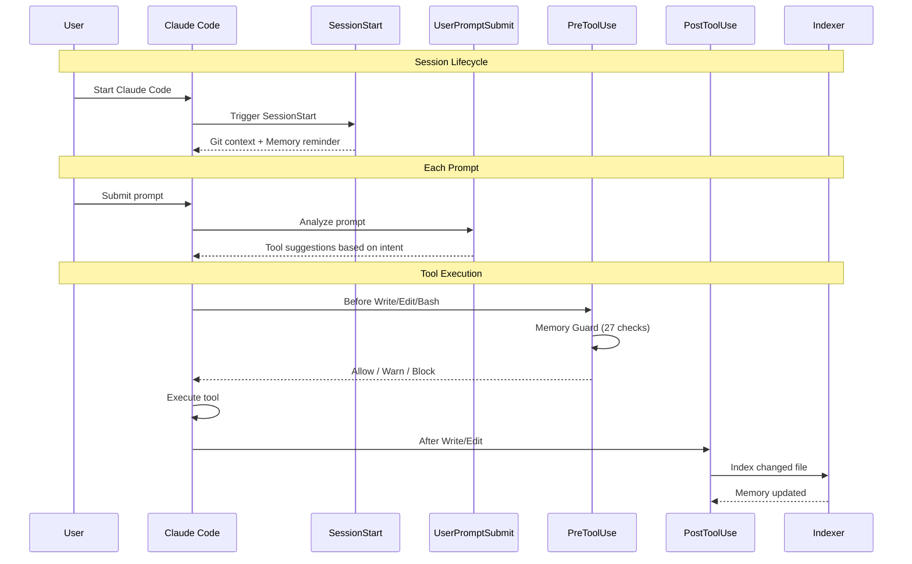
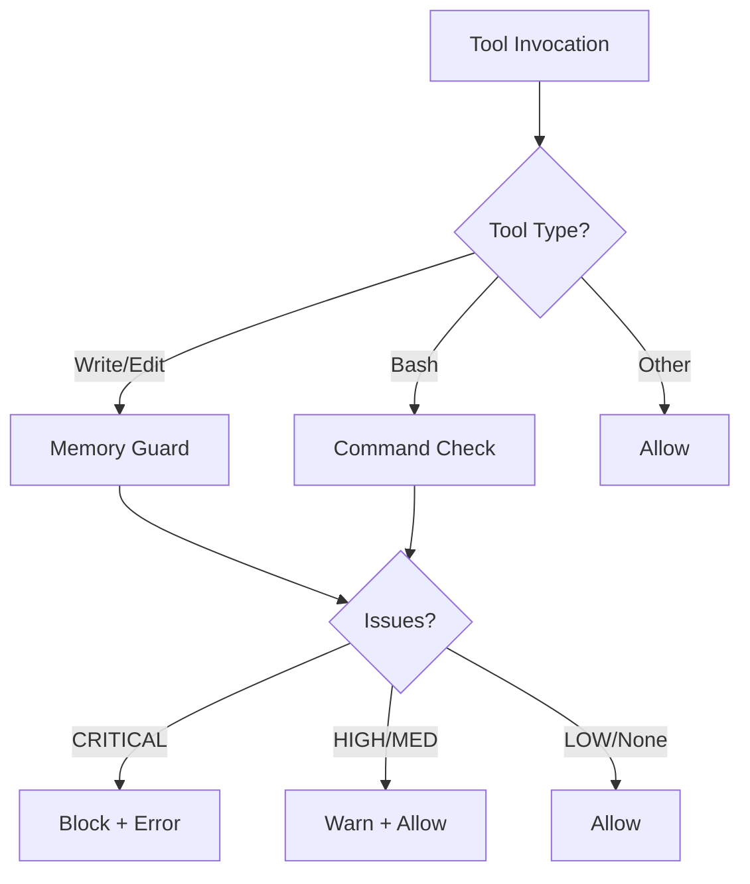

# Claude Code Hooks System

> **Automated memory operations** at key points in your development workflow

The hooks system integrates Claude Code Memory into your development workflow, automatically handling context injection, code quality checks, and memory updates.

---

## Architecture



---

## Available Hooks

### SessionStart (`session_start.py`)

**Trigger**: When a Claude Code session begins

**Purpose**:
- Display current git branch and status
- Show recent commit history
- Remind about memory-first workflow
- Inject MCP tool suggestions

**Performance**: < 100ms

**Output Example**:
```
=== Session Context ===
Branch: feature/new-auth
Uncommitted changes: 3 file(s)
Recent commits:
  - Add user validation
  - Fix login redirect
  - Update auth middleware

Memory-First Reminder:
  Use `mcp__project-memory__search_similar()` before reading files
  Use `mcp__project-memory__read_graph()` to understand relationships
```

---

### UserPromptSubmit (`prompt_handler.py`)

**Trigger**: Before Claude processes each user prompt

**Purpose**:
- Detect prompt intent (search, debug, implement, refactor, understand)
- Inject appropriate MCP tool suggestions
- Warn about sensitive content in prompts

**Performance**: < 50ms

**Intent Detection**:

| Intent | Trigger Words | Suggested Tool |
|--------|---------------|----------------|
| Search | find, search, locate, where | `search_similar()` |
| Debug | error, bug, fix, issue | `search_similar(..., entityTypes=["debugging_pattern"])` |
| Implement | add, create, build, write | `search_similar()` to find patterns |
| Refactor | refactor, improve, optimize | `read_graph(mode="smart")` |
| Understand | how does, explain, architecture | `read_graph()` |

**Output Example**:
```
User: "fix the authentication error"

Injected context:
Check `mcp__project-memory__search_similar("error description", entityTypes=["debugging_pattern"])` for past solutions
```

---

### PreToolUse (`pre-tool-guard.sh`)

**Trigger**: Before Write, Edit, or Bash operations

**Purpose**:
- Run Memory Guard quality checks (27 patterns)
- Prevent security vulnerabilities
- Catch tech debt markers
- Block dangerous operations

**Performance**: < 300ms (FAST mode)

**Decision Flow**:


**See**: [Memory Guard Documentation](MEMORY_GUARD.md) for full details.

---

### PostToolUse (`post-file-change.sh`)

**Trigger**: After Write or Edit operations complete successfully

**Purpose**:
- Auto-index the changed file
- Keep memory synchronized with codebase
- Enable immediate memory access to new code

**Performance**: ~100ms per file

**Batch Mode** (v2.8+):
When multiple files change (e.g., git operations), files are batched for 4-15x faster indexing.

---

## Git Hooks

In addition to Claude Code hooks, git hooks keep memory synchronized:

### pre-commit
```bash
# Indexes staged files before each commit
# Uses batch indexing for performance
echo "$STAGED_FILES" | claude-indexer index --files-from-stdin
```

### post-merge
```bash
# Re-indexes files changed by merge/pull
# Keeps memory current with incoming changes
```

### post-checkout
```bash
# Re-indexes files changed between branches
# Memory reflects current branch state
```

---

## Configuration

Hooks are configured in `.claude/settings.local.json`:

```json
{
  "hooks": {
    "SessionStart": [
      {
        "type": "command",
        "command": "/path/to/venv/bin/python /path/to/hooks/session_start.py"
      }
    ],
    "UserPromptSubmit": [
      {
        "type": "command",
        "command": "/path/to/venv/bin/python /path/to/hooks/prompt_handler.py"
      }
    ],
    "PreToolUse": [
      {
        "matcher": "Bash|Write|Edit",
        "hooks": [
          {
            "type": "command",
            "command": "/path/to/hooks/pre-tool-guard.sh"
          }
        ]
      }
    ],
    "PostToolUse": [
      {
        "matcher": "Write|Edit",
        "hooks": [
          {
            "type": "command",
            "command": "/path/to/hooks/post-file-change.sh"
          }
        ]
      }
    ]
  },
  "env": {
    "CLAUDE_MEMORY_COLLECTION": "your-project-name"
  }
}
```

### Template Variables

During `setup.sh`, these placeholders are replaced:

| Variable | Description |
|----------|-------------|
| `{{HOOKS_PATH}}` | Absolute path to hooks directory |
| `{{COLLECTION_NAME}}` | Qdrant collection name |
| `{{VENV_PYTHON}}` | Path to venv Python interpreter |

---

## Hook Files

| File | Type | Location |
|------|------|----------|
| `session_start.py` | Python | `.claude/hooks/` |
| `prompt_handler.py` | Python | `.claude/hooks/` |
| `pre-tool-guard.sh` | Bash | `.claude/hooks/` |
| `post-file-change.sh` | Bash | `.claude/hooks/` |
| `pre-commit` | Bash | `.git/hooks/` |
| `post-merge` | Bash | `.git/hooks/` |
| `post-checkout` | Bash | `.git/hooks/` |

---

## Performance Targets

| Hook | Target Latency | Actual |
|------|----------------|--------|
| SessionStart | < 100ms | 50-80ms |
| UserPromptSubmit | < 50ms | 10-30ms |
| PreToolUse (FAST) | < 300ms | 150-250ms |
| PostToolUse | < 200ms | 100-150ms |

---

## Error Handling

All hooks follow **fail-open** design:
- Errors are logged but never block operations
- Graceful degradation on missing dependencies
- User always able to continue work

```bash
# Example from pre-tool-guard.sh
trap 'exit 0' ERR  # On any error, allow operation
```

---

## Debugging

### Check Hook Status
```bash
# Verify hooks are installed
ls -la .claude/hooks/
ls -la .git/hooks/
```

### View Hook Logs
```bash
# Memory Guard log
cat ~/.claude-code-memory/guard.log

# Project-specific debug log
cat memory_guard_debug.txt
```

### Test Hooks Manually
```bash
# Test session start
echo '{"cwd": "/path/to/project"}' | python .claude/hooks/session_start.py

# Test prompt handler
echo '{"prompt": "fix the auth bug"}' | python .claude/hooks/prompt_handler.py
```

---

## Creating Custom Hooks

### Basic Structure

```python
#!/usr/bin/env python3
"""Custom hook template."""

import json
import sys
import os

def main():
    try:
        # Read input from stdin
        input_data = json.load(sys.stdin)

        # Get collection from environment
        collection = os.environ.get("CLAUDE_MEMORY_COLLECTION", "project")

        # Your hook logic here
        # ...

        # Output context to inject (optional)
        print("Your context message here")

        sys.exit(0)  # Success

    except Exception as e:
        # Fail open - never block on errors
        sys.stderr.write(f"Hook warning: {e}\n")
        sys.exit(0)

if __name__ == "__main__":
    main()
```

### Input Data

Each hook receives JSON on stdin:

**SessionStart**:
```json
{
  "cwd": "/path/to/project"
}
```

**UserPromptSubmit**:
```json
{
  "prompt": "User's prompt text"
}
```

**PreToolUse**:
```json
{
  "tool_name": "Write",
  "tool_input": {
    "file_path": "/path/to/file.py",
    "content": "file content..."
  }
}
```

### Exit Codes

| Code | Meaning | Effect |
|------|---------|--------|
| 0 | Success/Allow | Operation proceeds |
| 1 | Warning | Message shown, operation proceeds |
| 2 | Block | Operation rejected |

---

## Related Documentation

- [Memory Guard](MEMORY_GUARD.md) - Quality check details
- [CLI Reference](CLI_REFERENCE.md) - Indexer commands
- [Architecture](../ARCHITECTURE.md) - System overview
