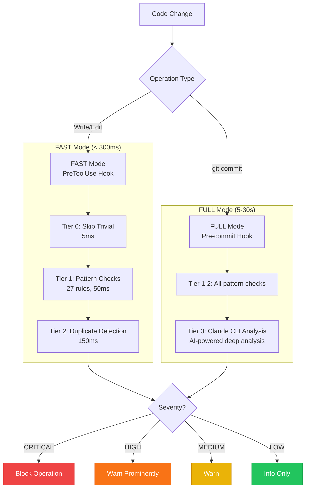

# Memory Guard v4.3 - Code Quality Enforcement

> **27 pattern-based checks** protecting your codebase from security vulnerabilities, tech debt, and anti-patterns

Memory Guard is an intelligent code quality gate that runs automatically on every Write/Edit operation in Claude Code. It prevents common mistakes before they enter your codebase.

---

## Architecture



---

## Two-Mode Architecture

### FAST Mode (PreToolUse Hook)
- **When**: Every Write/Edit operation during development
- **Latency**: < 300ms
- **Checks**: Tier 0-2 (pattern matching + duplicate detection)
- **Purpose**: Snappy editing experience, catch obvious issues

### FULL Mode (Pre-commit Hook)
- **When**: Before each git commit
- **Latency**: 5-30 seconds
- **Checks**: All tiers including Tier 3 (AI analysis)
- **Purpose**: Thorough validation before code enters repository

---

## Quality Checks (27 Total)

### Security Checks (11)

| Check | Severity | Pattern | Description |
|-------|----------|---------|-------------|
| **SQL Injection** | CRITICAL | `f"SELECT...{var}"` | String interpolation in SQL queries |
| **XSS** | HIGH | `innerHTML`, `dangerouslySetInnerHTML` | Unsafe HTML insertion |
| **Command Injection** | HIGH | `eval()`, `os.system(f"...")` | Shell command with user input |
| **Hardcoded Secrets** | HIGH | `password = "secret"` | Credentials in source code |
| **Logging Secrets** | HIGH | `logger.info(f"...{password}")` | Sensitive data in logs |
| **Weak Crypto** | HIGH | `md5(password)` | Weak hashing for passwords |
| **Insecure Deserialize** | HIGH | `pickle.load()`, `yaml.load()` | Unsafe deserialization |
| **Path Traversal** | MEDIUM | `../../..` | Directory traversal patterns |
| **Sensitive Files** | BLOCK | `.env`, `credentials`, `.ssh/` | Modification of secrets files |
| **Force Push** | BLOCK | `git push --force` | Dangerous git operations |
| **Hard Reset** | BLOCK | `git reset --hard` | Destructive git operations |

#### SQL Injection Example
```python
# BAD - CRITICAL: SQL injection vulnerability
query = f"SELECT * FROM users WHERE id={user_id}"
cursor.execute(query)

# GOOD - Use parameterized queries
cursor.execute("SELECT * FROM users WHERE id=?", (user_id,))
```

#### Logging Secrets Example
```python
# BAD - HIGH: Sensitive data in logs
logger.info(f"Login attempt with password {password}")

# GOOD - Never log credentials
logger.info(f"Login attempt for user {username}")
```

---

### Tech Debt Checks (9)

| Check | Severity | Pattern | Description |
|-------|----------|---------|-------------|
| **TODO without Ticket** | LOW | `# TODO` without `ABC-123` | Untracked work items |
| **FIXME Marker** | HIGH | `# FIXME` | Known bugs requiring attention |
| **HACK Marker** | MEDIUM | `# HACK` | Fragile workarounds |
| **DEPRECATED Marker** | MEDIUM | `@deprecated` | Code needing migration |
| **Debug Statements** | LOW | `print()`, `console.log()` | Debug code in production |
| **Unexplained Suppressions** | LOW | `# noqa` without code | Bare lint suppressions |
| **Bare Except** | MEDIUM | `except:` | Catches all exceptions |
| **Mutable Default** | MEDIUM | `def foo(items=[])` | Python mutable default footgun |
| **Swallowed Exception** | MEDIUM | `except: pass` | Silent error handling |

#### Bare Except Example
```python
# BAD - MEDIUM: Catches KeyboardInterrupt, SystemExit
try:
    risky_operation()
except:
    pass

# GOOD - Specify exception type
try:
    risky_operation()
except Exception as e:
    logger.error(f"Operation failed: {e}")
```

#### Mutable Default Example
```python
# BAD - MEDIUM: Shared mutable state between calls
def append_item(item, items=[]):
    items.append(item)
    return items

# GOOD - Use None sentinel
def append_item(item, items=None):
    if items is None:
        items = []
    items.append(item)
    return items
```

---

### Documentation Checks (2)

| Check | Severity | Pattern | Description |
|-------|----------|---------|-------------|
| **Missing Docstring** | LOW | Python function >10 lines | No docstring on substantial functions |
| **Missing JSDoc** | LOW | JS/TS function >10 lines | No JSDoc on substantial functions |

---

### Resilience Checks (2)

| Check | Severity | Pattern | Description |
|-------|----------|---------|-------------|
| **Swallowed Exception** | MEDIUM | `except: pass` or `catch {}` | Empty exception handlers |
| **Missing Timeout** | MEDIUM | `requests.get()` without timeout | HTTP calls that can hang |

#### Missing Timeout Example
```python
# BAD - MEDIUM: Can hang indefinitely
response = requests.get("https://api.example.com/data")

# GOOD - Always set timeout
response = requests.get("https://api.example.com/data", timeout=30)
```

---

### Git Safety Checks (3)

| Check | Severity | Pattern | Description |
|-------|----------|---------|-------------|
| **Force Push** | BLOCK | `git push --force` | Destructive remote operation |
| **Hard Reset** | BLOCK | `git reset --hard` | Destructive local operation |
| **Destructive RM** | BLOCK | `rm -rf /` patterns | Dangerous file deletion |

---

## Severity Levels

| Level | Exit Code | Behavior | Examples |
|-------|-----------|----------|----------|
| **CRITICAL** | 2 | Block operation | SQL injection, sensitive files |
| **HIGH** | 1 | Warn prominently | XSS, hardcoded secrets, FIXME |
| **MEDIUM** | 1 | Warn | Swallowed exceptions, HACK markers |
| **LOW** | 0 | Info only | Debug statements, TODO without ticket |

---

## Override Mechanisms

### Inline Override Comments

Add a comment to bypass checks for specific code:

```python
# @allow-duplicate: Legacy API compatibility required
def hash_password_legacy(password):
    return md5(password)  # Memory Guard will skip this
```

### Session Control Commands

Control Memory Guard behavior during a session:

```
You: dups off      # Disable Memory Guard for this session
Claude: Memory Guard disabled for this session

You: dups status   # Check current status
Claude: Memory Guard Status: DISABLED

You: dups on       # Re-enable protection
Claude: Memory Guard enabled for this session
```

### Configuration File

Create `.guard.conf` in your project root:

```bash
# Disable specific checks
DISABLE_CHECKS="todo_without_ticket debug_statement"

# Set minimum severity (0=all, 1=medium+, 2=high+, 3=critical only)
MIN_SEVERITY=1

# Enable/disable logging
ENABLE_LOGGING=true
```

---

## Tier Architecture

### Tier 0: Trivial Operation Skip (< 5ms)
- Detects operations that don't need checking
- Skip criteria: tiny changes, comments only, whitespace

### Tier 1: Pattern Checks (~ 50ms)
- All 27 regex-based pattern checks
- Fast, deterministic matching
- No external dependencies

### Tier 2: Duplicate Detection (~ 150ms)
- Signature hash matching (O(1) exact duplicates)
- Semantic similarity search via MCP
- Finds copy-paste code with variations

### Tier 3: AI Analysis (5-30s)
- Full Claude CLI analysis with MCP memory tools
- Only runs at pre-commit time
- Deep understanding of code intent and impact

---

## File Processing

### Files Checked
- `.py` - Python files (all checks)
- `.js`, `.jsx` - JavaScript files
- `.ts`, `.tsx` - TypeScript files
- `.sh`, `.bash` - Shell scripts

### Files Skipped
- `.md`, `.txt` - Documentation
- `.json`, `.yaml`, `.yml` - Configuration
- `.css`, `.scss` - Styles
- Binary files
- Files in `.gitignore`

---

## Logs and Debugging

### Event Log
All guard events are logged to `~/.claude-code-memory/guard.log`:

```
2024-12-08T10:30:15-05:00 BLOCK sql_injection src/api/users.py
2024-12-08T10:30:45-05:00 WARN hardcoded_secret src/config.py
2024-12-08T10:31:20-05:00 INFO todo_without_ticket src/utils.py
```

### Debug Mode
For troubleshooting, check the debug log in your project:
```bash
cat memory_guard_debug.txt
```

---

## Integration

### PreToolUse Hook (settings.local.json)
```json
{
  "hooks": {
    "PreToolUse": [
      {
        "matcher": "Bash|Write|Edit",
        "hooks": [
          {
            "type": "command",
            "command": "/path/to/hooks/pre-tool-guard.sh"
          }
        ]
      }
    ]
  }
}
```

### Pre-commit Hook (.git/hooks/pre-commit)
```bash
#!/bin/bash
# Memory Guard FULL mode - runs before each commit
exec /path/to/hooks/pre-commit-guard.sh
```

---

## Performance

| Mode | Latency | Checks Run |
|------|---------|------------|
| FAST (editing) | < 300ms | Tier 0-2 |
| FULL (commit) | 5-30s | All tiers |

The two-mode architecture ensures:
- Snappy editing experience during development
- Thorough analysis before code enters repository
- Never blocks legitimate work when in doubt

---

## Related Documentation

- [Architecture](../ARCHITECTURE.md) - System overview
- [Hooks System](HOOKS.md) - All Claude Code hooks
- [CLI Reference](CLI_REFERENCE.md) - Command-line interface
