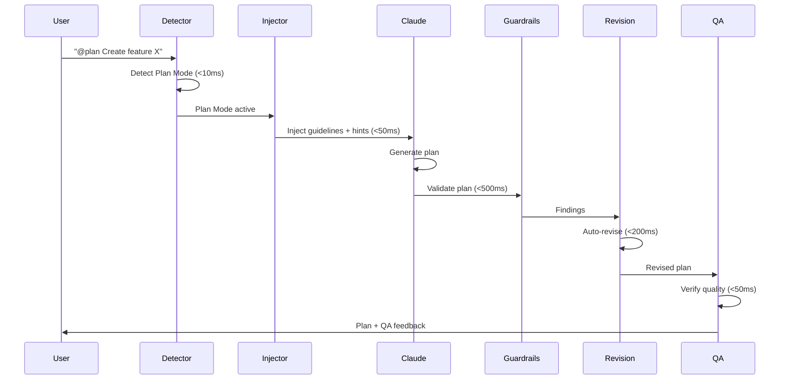

# Plan Mode Integration Guide

> Automatically enhance Claude Code's Plan Mode with quality guardrails, auto-revision, and rich context

---

## Table of Contents

1. [Quick Start](#quick-start)
2. [How It Works](#how-it-works)
3. [Plan Mode Detection](#plan-mode-detection)
4. [Context Injection](#context-injection)
5. [Quality Guardrails](#quality-guardrails)
6. [Auto-Revision System](#auto-revision-system)
7. [Plan QA Verification](#plan-qa-verification)
8. [Configuration Reference](#configuration-reference)
9. [Troubleshooting](#troubleshooting)
10. [Performance](#performance)

---

## Quick Start

Plan Mode integration activates automatically when Claude Code enters planning mode. No additional setup is required beyond the standard Claude Code Memory installation.

### Activation Methods

```bash
# Explicit marker (recommended)
@plan Create an authentication system for the app

# Planning keywords (auto-detected)
Create a step-by-step plan for implementing user authentication

# Environment variable
export CLAUDE_PLAN_MODE=true
```

### What Happens Automatically

1. **Planning guidelines** injected into context
2. **Exploration hints** suggest memory queries
3. **Quality guardrails** validate the generated plan
4. **Auto-revision** adds missing tasks (tests, docs)
5. **QA verification** ensures plan completeness

---

## How It Works



### Pipeline Stages

| Stage | Component | Latency | Purpose |
|-------|-----------|---------|---------|
| 1 | Plan Mode Detector | <10ms | Identify planning intent |
| 2 | Context Injector | <50ms | Add guidelines + hints |
| 3 | Guardrail Engine | <500ms | Validate against 5 rules |
| 4 | Auto-Revision | <200ms | Fix issues automatically |
| 5 | Plan QA | <50ms | Final verification |

**Total overhead**: <100ms (excluding validation)

---

## Plan Mode Detection

The detector uses four signals to identify when Claude is in planning mode:

### 1. Explicit Markers (1.0 confidence)

```
@agent-plan    # Full explicit marker
@plan          # Short marker
--plan         # Flag style
plan mode      # Natural language
```

### 2. Planning Keywords (0.7+ confidence)

Pattern: `(create|make|write|design|implement) ... plan`

```
"Create a plan for authentication"     # 0.7 confidence
"Design a step-by-step migration plan" # 0.8 confidence (boosted)
"Write a detailed implementation plan" # 0.7 confidence
```

**Confidence Boosters** (+0.1 each):
- "step-by-step"
- "phases"
- "milestones"
- "tasks"
- "timeline"
- "roadmap"

**Confidence Reducers** (-0.15):
- "execute"
- "run"
- "implement this"
- "start coding"

### 3. Environment Variable (1.0 confidence)

```bash
export CLAUDE_PLAN_MODE=true   # Enable
export CLAUDE_PLAN_MODE=false  # Disable
```

Accepted values: `true`, `1`, `yes`, `on` (case-insensitive)

### 4. Session Persistence

Once Plan Mode is detected, it persists for the session unless explicitly disabled.

### Detection Result

```python
{
    "is_plan_mode": True,
    "confidence": 1.0,
    "source": "explicit_marker",
    "detected_markers": ["@plan"],
    "detection_time_ms": 0.5,
    "reasoning": "Explicit @plan marker detected"
}
```

---

## Context Injection

When Plan Mode is detected, two types of context are injected:

### Planning Guidelines

Five sections guide Claude toward high-quality plans:

#### 1. Code Reuse Check (CRITICAL)

```markdown
Before proposing ANY new function, class, or component:
- Search the codebase: `mcp__project-memory__search_similar("functionality")`
- Check existing patterns: `mcp__project-memory__read_graph(entity="Component")`
- If similar exists, plan to REUSE or EXTEND it
- State explicitly: "Verified no existing implementation" or "Will extend existing Y"
```

#### 2. Testing Requirements

```markdown
Every plan that modifies code MUST include:
- [ ] Unit tests for new/modified functions
- [ ] Integration tests for API changes
- Task format: "Add tests for [feature] in [test_file]"
```

#### 3. Documentation Requirements

```markdown
Include documentation tasks when:
- Adding public APIs -> Update API docs
- Changing user-facing behavior -> Update README
- Adding configuration -> Update config docs
```

#### 4. Architecture Alignment

```markdown
Your plan MUST align with project patterns:
[Patterns extracted from CLAUDE.md]
```

#### 5. Performance Considerations

```markdown
Flag any step that may introduce:
- O(n^2) or worse complexity
- Unbounded memory usage
- Missing timeouts on network calls
```

### Exploration Hints

Suggested MCP queries based on entities extracted from the prompt:

```markdown
## Duplicate Check
mcp__project-memory__search_similar("UserService", entityTypes=["function", "class"])

## Test Discovery
mcp__project-memory__search_similar("UserService test", entityTypes=["file", "function"])

## Documentation
mcp__project-memory__search_similar("documentation README", entityTypes=["documentation"])

## Entity Analysis
mcp__project-memory__read_graph(entity="UserService", mode="smart")
```

### Entity Extraction

Entities are extracted from prompts using pattern matching:

| Pattern | Example | Extraction |
|---------|---------|------------|
| CamelCase | `UserService` | Class/component names |
| snake_case | `user_service` | Function/variable names |
| Quoted | `"login"` | Specific terms |
| Technical | `api`, `database` | Domain terms |

---

## Quality Guardrails

Five validation rules ensure plan quality:

### PLAN.TEST_REQUIREMENT

| Property | Value |
|----------|-------|
| Category | coverage |
| Severity | MEDIUM |
| Is Fast | Yes |

**Detects**: Feature/implementation tasks without corresponding test tasks.

**Trigger Keywords**:
- implement, add, create, build, develop, introduce, design, write

**Trivial Exceptions** (no test required):
- fix typo, rename, move, delete comment, update readme

**Auto-Revision**: Adds a test task with:
- ID: `TASK-TST-{feature_id}`
- Title: "Add tests for {feature_title}"
- Dependency on the feature task
- Tags: `["testing", "quality"]`

**Example**:
```
Finding: Task "Implement user authentication" has no test task
Suggestion: Add unit/integration test task for authentication
Auto-Fix: Creates "Add tests for user authentication" task
```

---

### PLAN.DOC_REQUIREMENT

| Property | Value |
|----------|-------|
| Category | coverage |
| Severity | LOW |
| Is Fast | Yes |

**Detects**: User-facing changes without documentation tasks.

**User-Facing Indicators**:
- api, user, interface, config, cli, command, endpoint
- ui, ux, frontend, dashboard, setting, option
- public, external, exposed, visible, accessible

**Auto-Revision**: Adds a documentation task with:
- ID: `TASK-DOC-{feature_id}`
- Title: "Document {feature_title}"
- Dependency on the feature task
- Tags: `["documentation"]`

---

### PLAN.DUPLICATE_DETECTION

| Property | Value |
|----------|-------|
| Category | consistency |
| Severity | HIGH |
| Is Fast | No (uses memory search) |

**Detects**: Tasks proposing code that may already exist in the codebase.

**Similarity Threshold**: 70% (configurable)

**Search Entity Types**:
- function
- class
- implementation_pattern

**Auto-Revision**: Modifies the task description to:
- Reference the existing implementation
- Add acceptance criteria: "Verified no duplication with existing code"

**Example**:
```
Finding: Task "Create password hasher" is 85% similar to existing hashPassword() in auth/utils.py
Suggestion: Review existing implementation before proceeding
Auto-Fix: Adds note referencing auth/utils.py:hashPassword()
```

---

### PLAN.ARCHITECTURAL_CONSISTENCY

| Property | Value |
|----------|-------|
| Category | architecture |
| Severity | MEDIUM |
| Is Fast | Yes |

**Detects**: File paths that don't match established project patterns.

**Expected Patterns**:

| Type | Expected Locations |
|------|-------------------|
| tests | `tests/`, `__tests__/`, `*.test.py`, `*.spec.ts` |
| components | `src/components/`, `app/components/` |
| utils | `src/utils/`, `lib/`, `helpers/` |
| config | `src/config/`, `*.config.py` |
| api | `src/api/`, `routes/`, `endpoints/` |
| models | `src/models/`, `entities/`, `schemas/` |
| services | `src/services/`, `providers/` |

**Auto-Revision**: Adds a warning note to the task about the non-standard location.

---

### PLAN.PERFORMANCE_PATTERN

| Property | Value |
|----------|-------|
| Category | performance |
| Severity | LOW |
| Is Fast | Yes |

**Detects**: Potential performance anti-patterns in task descriptions.

**Anti-Patterns**:

| Pattern | Detection | Suggestion |
|---------|-----------|------------|
| N+1 Query | "for each...query", "individual requests" | Batch database queries, use eager loading |
| Missing Cache | "no cache", "every request", "always fetch" | Implement caching strategy |
| Blocking Operation | "synchronous", "blocking", "wait for" | Use async/await, background jobs |
| Unbounded Load | "load all", "fetch everything" | Implement pagination, lazy loading |
| Large Payload | "entire object", "full response" | Use field selection, streaming |

**Auto-Revision**: Adds a performance note with specific suggestions.

---

## Auto-Revision System

The auto-revision engine applies fixes automatically based on guardrail findings.

### Revision Types

```python
class RevisionType(Enum):
    ADD_TASK = "add_task"           # Add missing test/doc task
    MODIFY_TASK = "modify_task"     # Update description/criteria
    REMOVE_TASK = "remove_task"     # Remove redundant task
    ADD_DEPENDENCY = "add_dependency"  # Link tasks
    REORDER_TASKS = "reorder_tasks"    # Fix execution order
```

### Processing Order

1. **Sort by severity**: CRITICAL > HIGH > MEDIUM > LOW
2. **Check for conflicts**: Ensure revision won't break plan
3. **Detect cycles**: Prevent circular dependencies
4. **Apply revision**: Modify plan in-place
5. **Resolve dependencies**: Clean up orphaned references

### Safety Limits

| Setting | Default | Purpose |
|---------|---------|---------|
| MAX_ITERATIONS | 3 | Prevent infinite loops |
| max_revisions_per_plan | 10 | Limit total changes |
| revision_confidence_threshold | 0.7 | Minimum confidence to apply |

### Conflict Detection

Revisions are skipped if they would:
- Create a task with an existing ID
- Introduce circular dependencies
- Modify a non-existent task
- Remove a task that others depend on

### Audit Trail

All revisions are tracked for transparency:

```markdown
## Plan Revisions Applied

### 1. Added Test Task (PLAN.TEST_REQUIREMENT)
- **Reason**: Feature 'Add user authentication' needs test coverage
- **Added**: TASK-TST-0001 "Add tests for user authentication"
- **Confidence**: 95%

### 2. Modified Task (PLAN.DUPLICATE_DETECTION)
- **Reason**: Potential duplicate of existing 'AuthService.login()'
- **Modified**: TASK-0002 description to reference existing code
- **Confidence**: 78%
```

---

## Plan QA Verification

Post-generation verification ensures the final plan meets quality standards.

### Checks Performed

| Check | Detection Pattern | Suggestion |
|-------|------------------|------------|
| Missing Tests | Code changes without test tasks | "Add unit/integration test task" |
| Missing Docs | User-facing changes without doc tasks | "Add documentation task" |
| No Reuse Check | New code without duplicate verification | "Verify no existing implementation" |
| Architecture | Performance anti-patterns detected | Specific performance notes |

### Feedback Format

```markdown
=== Plan QA Feedback ===

[WARN] Missing Test Coverage:
  - Plan modifies code but includes no test tasks

[WARN] Potential Duplicates (no explicit reuse check):
  - New UserService implementation without checking existing code

[SUGGESTIONS]:
  - Add unit/integration test task
  - Search memory for existing implementations before coding

=== End Plan QA ===
```

Or if all checks pass:

```markdown
[Plan QA: All quality checks passed]
```

---

## Configuration Reference

### Environment Variables

| Variable | Values | Default | Purpose |
|----------|--------|---------|---------|
| `CLAUDE_PLAN_MODE` | true/false/1/0/yes/no | false | Force Plan Mode on/off |
| `CLAUDE_PLAN_MODE_COMPACT` | true/false | false | Use abbreviated guidelines |
| `CLAUDE_PLAN_MODE_CONFIG` | file path | none | Custom config file |

### PlanGuardrailConfig

```python
class PlanGuardrailConfig(BaseModel):
    # Master toggle
    enabled: bool = True

    # Category toggles
    check_coverage: bool = True      # Test/doc requirements
    check_consistency: bool = True   # Duplicate detection
    check_architecture: bool = True  # Pattern alignment
    check_performance: bool = True   # Anti-pattern detection

    # Auto-revision settings
    auto_revise: bool = True
    max_revisions_per_plan: int = 10
    revision_confidence_threshold: float = 0.7

    # Output limits
    max_findings_per_rule: int = 10

    # Severity thresholds
    severity_thresholds: dict = {
        "block": "HIGH",
        "warn": "MEDIUM"
    }

    # Rule-specific configuration
    rules: dict[str, RuleConfig] = {}
```

### RuleConfig

```python
class RuleConfig(BaseModel):
    enabled: bool = True
    severity: str = "MEDIUM"
    threshold: float | None = None  # For duplicate detection
    auto_revise: bool = True
```

### PlanQAConfig

```python
@dataclass
class PlanQAConfig:
    enabled: bool = True
    check_tests: bool = True
    check_docs: bool = True
    check_duplicates: bool = True
    check_architecture: bool = True
    fail_on_missing_tests: bool = False  # Strict mode
    fail_on_missing_docs: bool = False   # Strict mode
```

### Configuration File Example

```json
{
  "enabled": true,
  "inject_guidelines": true,
  "inject_hints": true,
  "compact_mode": false,
  "guidelines": {
    "include_code_reuse_check": true,
    "include_testing_requirements": true,
    "include_documentation_requirements": true,
    "include_architecture_alignment": true,
    "include_performance_considerations": true
  },
  "hints": {
    "max_entity_hints": 3,
    "include_duplicate_check": true,
    "include_test_discovery": true,
    "include_doc_discovery": true,
    "include_architecture_hints": true
  },
  "guardrails": {
    "check_coverage": true,
    "check_consistency": true,
    "auto_revise": true,
    "rules": {
      "PLAN.DUPLICATE_DETECTION": {
        "threshold": 0.75
      }
    }
  }
}
```

---

## Troubleshooting

### Plan Mode Not Detecting

**Symptoms**: No guidelines injected, no validation occurring

**Solutions**:
1. Use explicit marker: `@plan Your request here`
2. Set environment variable: `export CLAUDE_PLAN_MODE=true`
3. Check confidence threshold (default: 0.6)
4. Verify hook is configured in `.claude/settings.json`

**Debug**:
```bash
# Test detection directly
echo '{"prompt": "@plan Test"}' | python claude_indexer/hooks/prompt_handler.py
```

---

### Guidelines Not Injecting

**Symptoms**: Plan Mode detected but no guidelines appear

**Solutions**:
1. Check `CLAUDE_PLAN_MODE_CONFIG` path is valid
2. Verify `inject_guidelines: true` in config
3. Check `CLAUDE.md` exists for project patterns
4. Look for errors in hook output

**Debug**:
```bash
# Check guidelines generation
python -c "from claude_indexer.hooks.planning import generate_planning_guidelines; print(generate_planning_guidelines('test-collection'))"
```

---

### Rules Not Triggering

**Symptoms**: Plans pass validation without expected findings

**Solutions**:
1. Verify category toggles are enabled:
   - `check_coverage`, `check_consistency`, etc.
2. Check rule-specific config isn't disabled
3. Verify similarity threshold for duplicate detection
4. Ensure memory client is connected (for duplicate detection)

**Debug**:
```bash
# Test guardrail engine
python -c "
from claude_indexer.ui.plan.guardrails import PlanGuardrailEngine, PlanGuardrailConfig
engine = PlanGuardrailEngine(PlanGuardrailConfig())
print('Rules loaded:', list(engine.rules.keys()))
"
```

---

### Performance Issues

**Symptoms**: Plan validation taking too long (>1s)

**Solutions**:
1. Use `validate_fast()` for quick checks (<100ms)
2. Disable slow rules: `PLAN.DUPLICATE_DETECTION` uses memory search
3. Reduce `max_findings_per_rule` limit
4. Check memory search latency

**Optimization Options**:
```python
# Fast validation only
result = engine.validate_fast(context)

# Disable slow rules
config = PlanGuardrailConfig(
    check_consistency=False  # Disables duplicate detection
)
```

---

### Auto-Revision Not Working

**Symptoms**: Findings generated but plan not modified

**Solutions**:
1. Verify `auto_revise: true` in config
2. Check `revision_confidence_threshold` (default: 0.7)
3. Ensure finding has `can_auto_revise: true`
4. Check for revision conflicts in audit trail

---

### Memory Search Failing

**Symptoms**: Duplicate detection returns no results

**Solutions**:
1. Verify collection is indexed: `claude-indexer search "test" -c collection`
2. Check Qdrant connection: `curl http://localhost:6333/health`
3. Verify MCP server is running
4. Check API keys in `settings.txt`

---

## Performance

### Latency Targets

| Operation | Target | Typical | Notes |
|-----------|--------|---------|-------|
| Plan Mode Detection | <10ms | <1ms | Pattern matching |
| Guidelines Generation | <20ms | ~15ms | Template + CLAUDE.md |
| Exploration Hints | <30ms | ~20ms | Entity extraction |
| Context Injection | <50ms | ~35ms | Combined injection |
| Guardrail Validation | <500ms | ~200ms | 5 rules |
| Auto-Revision | <200ms | ~50ms | Conflict checking |
| Plan QA | <50ms | ~30ms | Pattern matching |
| **Total Overhead** | **<100ms** | **~70ms** | Excluding validation |

### Optimization Techniques

1. **LRU Caching**: CLAUDE.md patterns cached with mtime invalidation
2. **Entity Cache**: 128-entry cache for extracted entities
3. **Fast Rules First**: Quick rules run before slow ones
4. **Early Exit**: Stop on critical findings if configured
5. **Parallel Ready**: Engine supports parallel rule execution (flag available)

### Benchmarks

Run the performance benchmark suite:

```bash
pytest tests/benchmarks/test_plan_mode_performance.py -v
```

Tests include:
- Detection latency (p95 target)
- Guidelines generation (p95 target)
- Exploration hints (p95 target)
- Full validation pipeline
- Memory usage (<50MB peak)
- Scalability (linear scaling verification)

---

## Related Documentation

- [Hooks System](HOOKS.md) - Hook configuration and lifecycle
- [Memory Guard](MEMORY_GUARD.md) - Code quality enforcement
- [CLI Reference](CLI_REFERENCE.md) - Command line tools
- [Architecture](../ARCHITECTURE.md) - System design overview

---

*Part of Claude Code Memory - Milestone 13.3*
